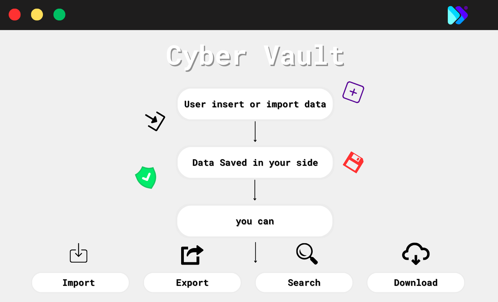
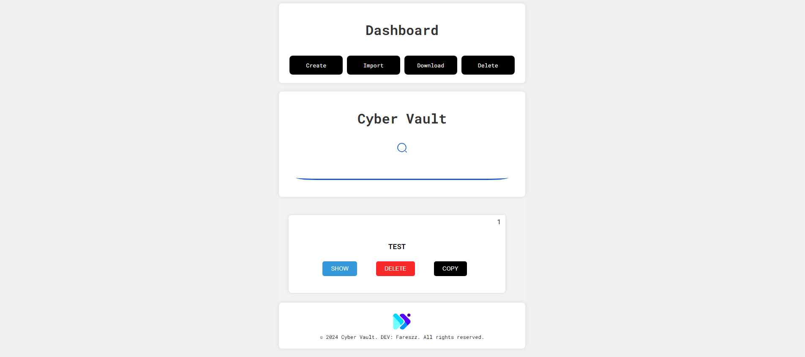

<p align="center">
  <a href="https://github.com/Fareszz1/CyberVault">
   
  </a>

  <h3 align="center">Cyber Vault</h3>

  <p align="center">
    The open-source Data Warehouse.
    <br />
    <a href="https://t.me/Fareszz">Telegram</a>
    ·
    <a href="https://github.com/Fareszz1/CyberVault/issues">Issues</a>
    ·
    <a href="https://code.visualstudio.com/">VS Code</a>
  </p>
</p>

<!-- ABOUT THE PROJECT -->

## About the Project


"CyberVault: Your digital fortress, securing your information locally for unparalleled peace of mind in the digital realm."

## Try Cyber Vault
 <a href="https://fareszz1.github.io/CyberVault">Click Here</a>

# More Than a Data Warehouse

CyberVault offers a safeguard for your data, operating solely on the client side for enhanced security. it ensures your information remains confidential and protected from unauthorized access. Experience peace of mind as CyberVault empowers you to store your valuable data in a safe and reliable environment, right at your fingertips.

- 🔒 Secure Storage: Safeguard your data, ensuring it remains confidential and protected from unauthorized access.
- 💻 Client-Side Operation: Operates exclusively on the client side, offering enhanced security and control over your information.
- 🔄 Backup: Enjoy peace of mind with backups to prevent data loss.
- 📁 Organized Structure: Easily organize your files and documents for efficient access.
- 🚀 Lightning Fast: Experience blazing-fast performance for seamless data management.
- 📈 Version Control: Keep track of changes and revert to previous versions effortlessly.
- 📡 Offline Access: Access your data even without an internet connection for uninterrupted productivity.

### Built With

- [js](https://www.javascript.com/)
- [html](https://html.com/)
- [css](https://www.w3schools.com/css/)

## Stay Up-to-Date

Cyber Vault officially launched as v1.0 on the 19th of Abril 2024 and we've come a long way so far. Watch **releases** of this repository to be notified of future updates:

<a href="https://github.com/Fareszz1/CyberVault">releases</a>

## Getting Started

just download the Cyber Vault and run **Index.html**.

### Setup
**Setup**

```sh
  1. Download Cyber Vault From Link Below:
```

```sh
  https://github.com/Fareszz1/CyberVault/archive/refs/heads/Main.zip
```

```sh
  2. Extract it in desktop
```

```sh
  3. RUN **Index.html**.
```

